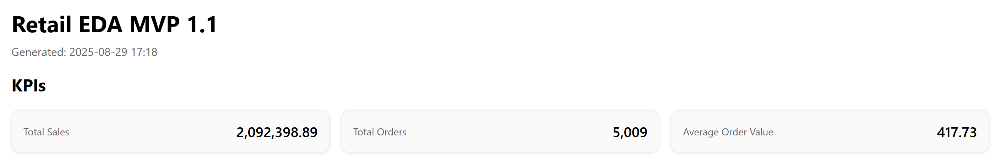
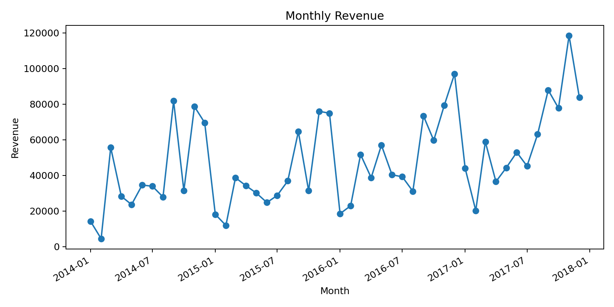
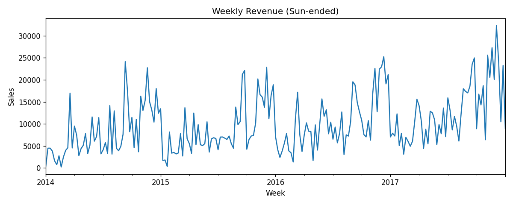
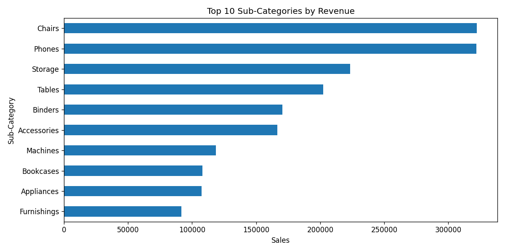

# Sales Forecast System (v1.1 — Enhanced EDA)

A full-stack retail analytics MVP built on Kaggle’s *Superstore* dataset.  
**New in v1.1:** enhanced EDA with outlier handling, weekly trends, Top-N subcategories, price–quantity scatter, profit analysis, and geo breakdown.  
Scope: Python EDA → forecasting → API → frontend → database logging → BI → Azure deployment.

---

## ✨ What’s new in v1.1

Compared with **v1.0 (MVP)**, this version adds more **real-world retail analytics** features:

- 🧹 **Outlier handling (Winsorisation)** — trim extreme Sales/Profit values  
- 📅 **Weekly revenue trend** — capture short-term seasonality  
- 🏆 **Top-N sub-categories** — see which product lines drive revenue  
- 📈 **Price vs Quantity scatter** — check unit price vs order size (sampled)  
- 💰 **Profit contribution & margins** — revenue ≠ profit; now both are shown  
- 🌍 **Geo-level revenue** — top regions/states/cities by revenue  

👉 All enhancements are toggleable flags — you can run a light MVP report or a full extended analysis with one command.

---

## 🖼️ Screenshots (v1.1)







---

## Quickstart (v1.1)

### Windows (PowerShell)
```powershell
python -m venv venv
.\venv\Scripts\Activate.ps1
python -m pip install --upgrade pip
pip install -r requirements.txt

# Minimal (KPIs + Monthly + Category)
python src\eda_v1.1.py --input data\Superstore.csv --outdir reports --title "Retail EDA — MVP 1.1"

# Full feature (all flags ON)
python src\eda_v1.1.py --input data\Superstore.csv --outdir reports --title "Retail EDA — MVP 1.1" `
  --enable-weekly 1 --enable-subcat 1 --enable-priceqty 1 --enable-profit 1 --enable-geo 1 `
  --winsor-pct 0.01 --top-n 10 --sample-n 2000

```

### macOS / Linux
```bash
python -m venv venv
source venv/bin/activate
python -m pip install --upgrade pip
pip install -r requirements.txt

# Minimal
python src/eda_v1.1.py --input data/Superstore.csv --outdir reports --title "Retail EDA — MVP 1.1"

# Full feature
python src/eda_v1.1.py --input data/Superstore.csv --outdir reports --title "Retail EDA — MVP 1.1" \
  --enable-weekly 1 --enable-subcat 1 --enable-priceqty 1 --enable-profit 1 --enable-geo 1 \
  --winsor-pct 0.01 --top-n 10 --sample-n 2000

```

Output: open reports/eda_report_1_1.html in your browser.

---

## Roadmap (iteration plan)

- [x] **1.0 — MVP**: Normalise CSV → KPIs → Monthly & Category charts → HTML report
- [x] **1.1 — Enhanced EDA**: Winsorisation, weekly/monthly aggregation, Top‑N, geo, profit contribution
- [ ] **1.2 — Forecasting**: Monthly aggregate → RF/XGBoost → *Actual vs Forecast* chart → save model
- [ ] **1.3 — FastAPI**: `/predict` endpoint returning JSON forecasts
- [ ] **1.4 — Next.js**: horizon input → call API → render charts
- [ ] **1.5 — PostgreSQL**: store forecasts & request logs
- [ ] **1.6 — Power BI**: direct PG connection for KPI dashboards
- [ ] **1.7 — Cloud deployment**: Azure (API + DB, EU region), Vercel/Azure SWA (frontend)
- [ ] **Final**: screenshots, architecture diagram, CI/CD, online demo

---

## Architecture (current → target)

**Now (1.1)**  
CSV → Normalise → KPIs + Charts (+weekly, TopN, profit, geo) → HTML report

**Target**  
```text
CSV / DWH ──> EDA (1.0/1.1) ──> Forecast (1.2) ──> FastAPI (1.3)
                                   │                   │
                                   ▼                   ▼
                              PostgreSQL (1.5) ──> Power BI (1.6)
                                   ▲
                                   │
                              Next.js (1.4)

Infra: Azure App Service/Container Apps + Azure Database for PostgreSQL + Vercel/Azure SWA (1.7)
```

---

## Project highlights

- One-command analytics: standardises messy CSVs and exports a stakeholder-ready HTML report
- Clear evolution from EDA to a production-style stack (ML → API → frontend → DB/BI → cloud)
- Reproducible & lightweight: pinned Python deps; no external services for v1.0/1.1
- EU-friendly defaults: runs locally; report excludes personal data; Azure EU region in deployment plan

---

## 📂 Project structure

```text
.
├─ assets/              # Screenshots used in README (KPI, Weekly, TopN, Profit)
├─ data/                # Input data (Superstore.csv - not committed to Git)
├─ reports/             # Generated HTML reports (gitignored)
├─ src/
│  ├─ eda_v1.0.py       # v1.0 script (MVP)
│  └─ eda_v1.1.py       # v1.1 script (Enhanced EDA, flags included)
├─ scripts/             # Helper scripts for quick run
│  ├─ run_eda.sh        # macOS/Linux helper
│  ├─ run_eda.ps1       # Windows PowerShell helper
├─ .github/
│  └─ workflows/
│     └─ smoke.yml      # Minimal CI (import + dependency check)
├─ requirements.txt     # Python dependencies
├─ LICENSE              # MIT License
└─ README.md            # Project documentation

```

---

## Dataset & licence

- Dataset: Kaggle *Sample Superstore* (public demo dataset)
- Intended for learning & portfolio use; not production
- Licence: MIT
