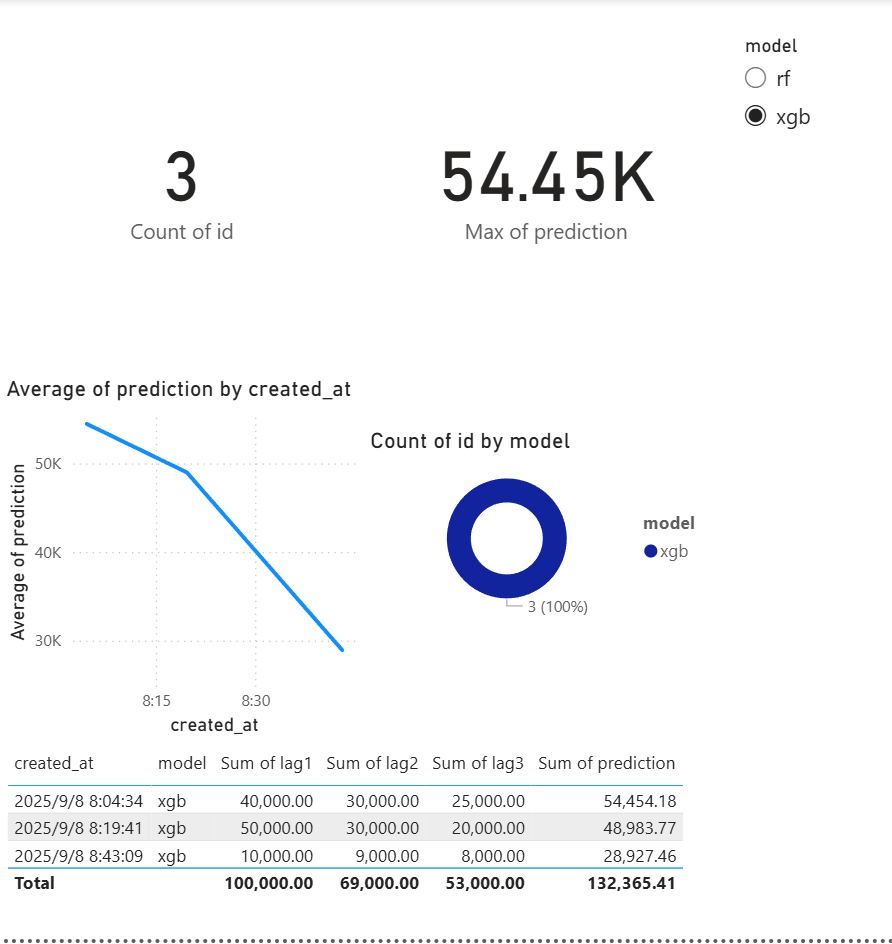
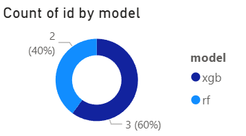
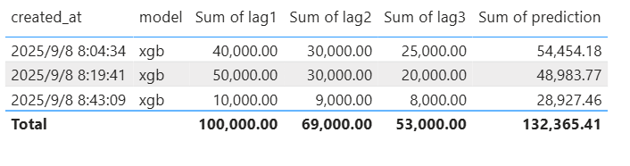

# Sales Forecast System (v1.6 — Power BI Dashboard)

A full-stack retail analytics MVP built on Kaggle’s Superstore dataset.

**New in v1.6:** integrated **Power BI dashboards** — PostgreSQL logs (from v1.5) are now visualized in interactive reports with KPIs, trend lines, model mix, and detailed logs.

Scope: Python EDA → forecasting → API → frontend → database logging → **BI dashboards** → Azure deployment.

---

## ✨ What’s new in v1.6

### Compared with v1.5 (FastAPI + DB logging), this version v1.6 adds visualization
- 📊 Power BI integration — connected directly to PostgreSQL `forecast_logs`
- 📈 KPIs — Total Predictions, Last Prediction value
- ⏳ Trend line — prediction values over time (continuous axis, average of predictions)
- 🥧 Donut chart — model usage ratio (RF vs XGB)
- 📋 Log table — last 20 predictions with lags & results
- 🎛️ Slicer — interactive filter to switch between RF / XGB
---

## 🖼️ Screenshots (v1.6)

- **Dashboard Overview** (KPI cards + trend + model ratio + logs)



- **Model Ratio (RF vs XGB)**

 

- **Prediction Logs Table**

 

---

## Quickstart (v1.6)

### 1. Ensure DB logging is active (from v1.5)
```powershell

uvicorn src.api_v1_5:app --reload --port 8000

```

Forecast requests will be logged to PostgreSQL in the `forecast_logs` table.

### 2. Connect Power BI to PostgreSQL

- Open Power BI Desktop → Get Data → PostgreSQL database

- Server: `localhost`, Database: `salesdb`

- Select table: `public.forecast_logs`

- Load data (optionally via Power Query for type casting)

### 3. Build dashboard visuals

- Card → Total Predictions (`id` count)

- Card → Last Prediction (`prediction` max by created_at)

- Line chart → X=`created_at`, Y=`prediction (Average)`

- Donut chart → Legend=`model`, Values=`id` count

- Table → Columns: created_at, model, lags, prediction

- Slicer → model (single select, RF vs XGB)

### 4. Save and export

Save the .pbix file locally.

---

## Roadmap (iteration plan)

- [x] **1.0 — MVP**: Normalise CSV → KPIs → Monthly & Category charts → HTML report
- [x] **1.1 — Enhanced EDA**: Winsorisation, weekly/monthly aggregation, Top‑N, geo, profit contribution
- [x] **1.2 — Forecasting**: Monthly aggregate → RF/XGBoost → *Actual vs Forecast* chart → save model
- [x] **1.3 — FastAPI**: `/predict` endpoint returning JSON forecasts
- [x] **1.4 — Next.js**: horizon input → call API → render charts
- [x] **1.5 — PostgreSQL**: store forecasts & request logs
- [x] **1.6 — Power BI**: direct PG connection for KPI dashboards
- [ ] **1.7 — Cloud deployment**: Azure (API + DB, EU region), Vercel/Azure SWA (frontend)
- [ ] **Final**: screenshots, architecture diagram, CI/CD, online demo

---

## Architecture (current → target)

**Now (v1.6)**
CSV → Forecast (RF/XGB) → Model.pkl → FastAPI API → Next.js frontend → PostgreSQL logs → **Power BI dashboards**

**Target**  
```text
CSV / DWH ──> EDA (1.0/1.1) ──> Forecast (1.2) ──> FastAPI (1.3)
                                   │                   │
                                   ▼                   ▼
                              PostgreSQL (1.5) ──> Power BI (1.6)
                                   ▲
                                   │
                              Next.js (1.4)

Infra: Azure App Service/Container Apps + Azure Database for PostgreSQL + Vercel/Azure SWA (1.7)
```

---

## Project highlights

- End-to-end pipeline: raw CSV → EDA → ML forecasting → API → frontend → DB logging → BI dashboards
- PostgreSQL provides persistence; Power BI adds professional-grade visualization
- KPI cards, trends, model usage ratio, and detailed logs all in one view
- Dashboard design follows business standards: top KPIs → trends → ratios → detail table → slicer filter
- Ready for cloud deployment with Azure + Vercel

---

## 📂 Project structure

```text
.
├─ .github/
│  └─ workflows/
│     └─ smoke.yml      # Minimal CI (import + dependency check)
├─ assets/              # Screenshots (Overview, Model Ratio, Logs Table)
├─ data/                # Input data (Superstore.csv - not committed to Git)
├─ frontend/            # v1.4 Next.js frontend app
│  ├─ app/
│  │  └─ page.tsx       # Main UI (inputs + forecast + logs)
│  ├─ package.json
│  └─ .env.local (gitignored)
├─ reports/             # Generated reports, figures, models (gitignored)
│  ├─ figures/          # All PNG charts
│  └─ models/           # Saved ML models (.pkl)
├─ scripts/
│  ├─ run_eda.sh        # macOS/Linux helper
│  ├─ run_eda.ps1       # Windows PowerShell helper
├─ src/
│  ├─ eda_v1.0.py       # v1.0 script (MVP)
│  ├─ eda_v1.1.py       # v1.1 script (Enhanced EDA)
│  └─ eda_v1.2.py       # v1.2 script (Forecasting with RF/XGB)
│  └─ api_v1_3.py       # v1.3 FastAPI backend
│  ├─ api_v1_5.py       # v1.5 FastAPI backend (DB logging)
│  └─ db.py             # SQLAlchemy models + Session
├─ requirements.txt     # Python dependencies (now includes psycopg2, sqlalchemy, python-dotenv)
├─ LICENSE              # MIT License
└─ README.md            # Project documentation


```

---

## Dataset & licence

- Dataset: Kaggle *Sample Superstore* (public demo dataset)
- Intended for learning & portfolio use; not production
- Licence: MIT
