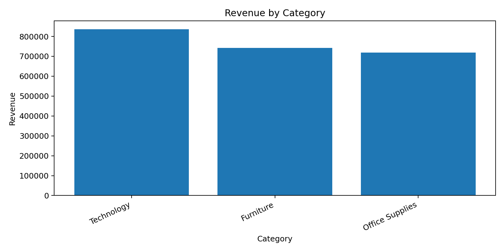

# Sales Forecast System

A full‑stack retail analytics MVP built on Kaggle’s *Superstore* dataset.  
Scope: Python EDA(v1.0) with a clear path to forecasting, APIs, frontend, database logging, BI, and Azure deployment.

---

## What’s in v1.0 (MVP)

- Schema normalisation for Superstore fields (`Order Date`, `Sales`, `Quantity`, `Category`, …)
- KPIs: Total Revenue, Total Orders, Average Order Value (order‑level where possible)
- Charts: Monthly revenue trend; Revenue by category
- Deliverable: lightweight HTML report saved to `reports/eda_report.html`
- Feature flags are pre‑wired (default OFF) so 1.1+ unlocks without refactor

---

## 🖼️ Screenshots




---

## Quickstart

### Windows (PowerShell)
```powershell
python -m venv venv
.venv\Scripts\Activate.ps1
python -m pip install --upgrade pip
pip install -r requirements.txt
python src\eda_v1.0.py --input data\Superstore.csv --outdir reports --title "Retail EDA — MVP 1.0"
```

### macOS / Linux
```bash
python -m venv venv
source venv/bin/activate
python -m pip install --upgrade pip
pip install -r requirements.txt
python src/eda_v1.0.py --input data/Superstore.csv --outdir reports --title "Retail EDA — MVP 1.0"
```

Output: open `reports/eda_report.html` in your browser.

---

## Optional: unlock 1.1 features

These are implemented behind flags (default OFF) to keep v1.0 minimal.

```bash
python src/eda_v1.0.py --input data/Superstore.csv --outdir reports   --enable-subcat 1 --enable-priceqty 1 --enable-profit 1   --enable-geo 1 --enable-weekly 1 --winsor-pct 0.01
```

**Flag reference**

- `--enable-subcat` — Top‑N sub‑categories by revenue
- `--enable-priceqty` — Unit price vs quantity scatter (sampled)
- `--enable-profit` — Profit margin / contribution charts (if `Profit` exists)
- `--enable-geo` — Top regions (auto‑selects State/City/Region)
- `--enable-weekly` — Weekly revenue trend
- `--winsor-pct` — Outlier clipping (e.g., `0.01` trims 1% tails)

---

## Roadmap (iteration plan)

- [x] **1.0 — MVP**: Normalise CSV → KPIs → Monthly & Category charts → HTML report
- [ ] **1.1 — Enhanced EDA**: Winsorisation, weekly/monthly aggregation, Top‑N, geo, profit contribution
- [ ] **1.2 — Forecasting**: Monthly aggregate → RF/XGBoost → *Actual vs Forecast* chart → save model
- [ ] **1.3 — FastAPI**: `/predict` endpoint returning JSON forecasts
- [ ] **1.4 — Next.js**: horizon input → call API → render charts
- [ ] **1.5 — PostgreSQL**: store forecasts & request logs
- [ ] **1.6 — Power BI**: direct PG connection for KPI dashboards
- [ ] **1.7 — Cloud deployment**: Azure (API + DB, EU region), Vercel/Azure SWA (frontend)
- [ ] **Final**: screenshots, architecture diagram, CI/CD, online demo

---

## Architecture (current → target)

**Now (1.0)**  
CSV → Normalise → KPIs & charts → HTML report

**Target**  
```text
CSV / DWH ──> EDA (1.0/1.1) ──> Forecast (1.2) ──> FastAPI (1.3)
                                   │                   │
                                   ▼                   ▼
                              PostgreSQL (1.5) ──> Power BI (1.6)
                                   ▲
                                   │
                              Next.js (1.4)

Infra: Azure App Service/Container Apps + Azure Database for PostgreSQL + Vercel/Azure SWA (1.7)
```

---

## Project highlights

- One‑command analytics: standardises messy CSVs and exports a stakeholder‑ready HTML report.
- Clear evolution from EDA to a production‑style stack (ML → API → frontend → DB/BI → cloud).
- Reproducible & lightweight: pinned Python deps; no external services for v1.0.
- EU‑friendly defaults: runs locally; report excludes personal data; Azure EU region in deployment plan.

---

## 📂 Project structure

```text
.
├─ assets/              # Screenshots used in README (KPI, Monthly, Category)
├─ data/                # Input data (Superstore.csv - not committed to Git)
├─ reports/             # Generated HTML reports (gitignored)
├─ src/
│  └─ eda_v1.0.py       # Main analysis script (flags included, default OFF)
├─ scripts/             # Helper scripts for quick run
│  ├─ run_eda.sh        # macOS/Linux helper
│  ├─ run_eda.ps1       # Windows PowerShell helper
├─ .github/
│  └─ workflows/
│     └─ smoke.yml      # Minimal CI (import + dependency check)
├─ requirements.txt     # Python dependencies
├─ LICENSE              # MIT License
└─ README.md            # Project documentation (this file)

---

## Dataset & licence

- Dataset: Kaggle *Sample Superstore* (public demo dataset)
- Intended for learning & portfolio use; not production
- Licence: MIT
