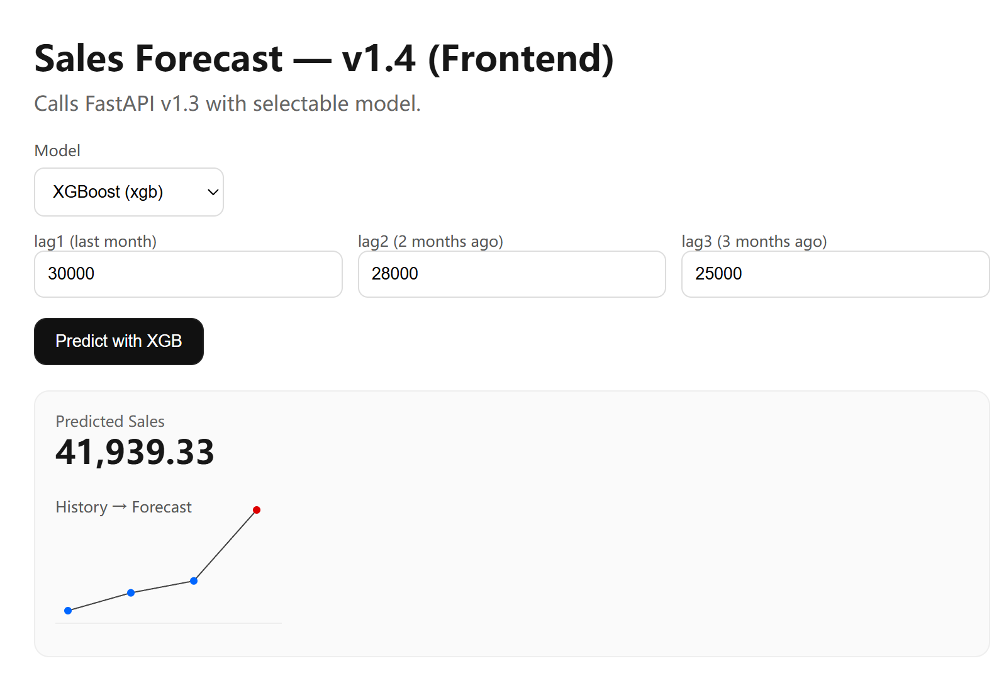

# Sales Forecast System (v1.4 — FastAPI + Frontend)

A full-stack retail analytics MVP built on Kaggle’s *Superstore* dataset.  
**New in v1.3 & v1.4:** deployed forecasting as an API with FastAPI, and connected a Next.js frontend to call predictions interactively (with RF/XGBoost model selection).  
Scope: Python EDA → forecasting → API → frontend → database logging → BI → Azure deployment.

---

## ✨ What’s new in v1.3 / v1.4

### v1.3 — FastAPI backend
- 📡 `/predict` endpoint → takes last 3 months’ sales (`lag1, lag2, lag3`), returns forecast
- ⚙️ Model loading from `reports/models/` (supports both **rf** and **xgb**)
- 🌍 `/models` endpoint → lists available models
- 🔒 CORS enabled for frontend integration
- 🤝 Designed for easy extension into DB logging (v1.5) and cloud deploy (v1.7)

### v1.4 — Next.js frontend
- 🎨 Minimal React/Next.js UI with TypeScript
- 📥 Inputs: last 3 months’ sales
- 🔽 Dropdown selector: choose **RandomForest** or **XGBoost**
- 🚀 Calls FastAPI `/predict` and renders forecast
- 📈 Sparkline mini-chart to show lag history → forecast
- 🌐 `.env.local` to configure API base URL

---

## 🖼️ Screenshots (v1.4)

- API Swagger UI (auto-docs at `http://127.0.0.1:8000/docs`)
- Next.js frontend form with RF/XGB selector
- Forecast output card + sparkline

(Add screenshots to `assets/` and embed here, e.g.)




---

## Quickstart (v1.3 + v1.4)

### 1. Train & save models (v1.2)
```powershell
python src\eda_v1.2.py --input data\Superstore.csv --outdir reports --title "Retail EDA — MVP 1.2"
python src\eda_v1.2.py --input data\Superstore.csv --outdir reports --title "Retail EDA — MVP 1.2 (XGB)" --model xgb
```

### 2. Start FastAPI backend (v1.3)
```bash
uvicorn api_v1_3:app --app-dir src --reload --port 8000
```

Visit:
· Docs: http://127.0.0.1:8000/docs
· Example: http://127.0.0.1:8000/predict?lag1=30000&lag2=28000&lag3=25000&model=rf

### 3. Start Next.js frontend (v1.4)
```bash
cd frontend
npm install
npm run dev
```

· App runs at http://localhost:3000
· Make sure .env.local contains:
```bash
NEXT_PUBLIC_API_BASE_URL=http://127.0.0.1:8000
```
---

## Roadmap (iteration plan)

- [x] **1.0 — MVP**: Normalise CSV → KPIs → Monthly & Category charts → HTML report
- [x] **1.1 — Enhanced EDA**: Winsorisation, weekly/monthly aggregation, Top‑N, geo, profit contribution
- [x] **1.2 — Forecasting**: Monthly aggregate → RF/XGBoost → *Actual vs Forecast* chart → save model
- [x] **1.3 — FastAPI**: `/predict` endpoint returning JSON forecasts
- [x] **1.4 — Next.js**: horizon input → call API → render charts
- [ ] **1.5 — PostgreSQL**: store forecasts & request logs
- [ ] **1.6 — Power BI**: direct PG connection for KPI dashboards
- [ ] **1.7 — Cloud deployment**: Azure (API + DB, EU region), Vercel/Azure SWA (frontend)
- [ ] **Final**: screenshots, architecture diagram, CI/CD, online demo

---

## Architecture (current → target)

**Now (1.4)**
CSV → Forecast (RF/XGB) → Model.pkl → FastAPI API → Next.js frontend

**Target**  
```text
CSV / DWH ──> EDA (1.0/1.1) ──> Forecast (1.2) ──> FastAPI (1.3)
                                   │                   │
                                   ▼                   ▼
                              PostgreSQL (1.5) ──> Power BI (1.6)
                                   ▲
                                   │
                              Next.js (1.4)

Infra: Azure App Service/Container Apps + Azure Database for PostgreSQL + Vercel/Azure SWA (1.7)
```

---

## Project highlights

- End-to-end pipeline: from raw CSV → EDA → forecasting → API → frontend
- Supports both RandomForest (baseline) and XGBoost, with models saved and reloadable
- FastAPI backend provides a simple /predict endpoint that any service can call
- Next.js frontend lets you input recent sales, pick a model (RF/XGB), and see results instantly
- Code is lightweight, runs locally, and uses only demo retail data
- Built with a clear roadmap in mind: API → DB logging → BI dashboards → cloud deployment

---

## 📂 Project structure

```text
.
├─ .github/
│  └─ workflows/
│     └─ smoke.yml      # Minimal CI (import + dependency check)
├─ assets/              # Screenshots used in README (KPI, Weekly, Forecast, etc.)
├─ data/                # Input data (Superstore.csv - not committed to Git)
├─ frontend/            # v1.4 Next.js frontend app
│  ├─ app/
│  │  └─ page.tsx
│  ├─ package.json
│  └─ .env.local (gitignored)
├─ reports/             # Generated reports, figures, models (gitignored)
│  ├─ figures/          # All PNG charts
│  └─ models/           # Saved ML models (.pkl)
├─ scripts/
│  ├─ run_eda.sh        # macOS/Linux helper
│  ├─ run_eda.ps1       # Windows PowerShell helper
├─ src/
│  ├─ eda_v1.0.py       # v1.0 script (MVP)
│  ├─ eda_v1.1.py       # v1.1 script (Enhanced EDA)
│  └─ eda_v1.2.py       # v1.2 script (Forecasting with RF/XGB)
│  └─ api_v1_3.py       # v1.3 FastAPI backend
├─ requirements.txt     # Python dependencies
├─ LICENSE              # MIT License
└─ README.md            # Project documentation


```

---

## Dataset & licence

- Dataset: Kaggle *Sample Superstore* (public demo dataset)
- Intended for learning & portfolio use; not production
- Licence: MIT
