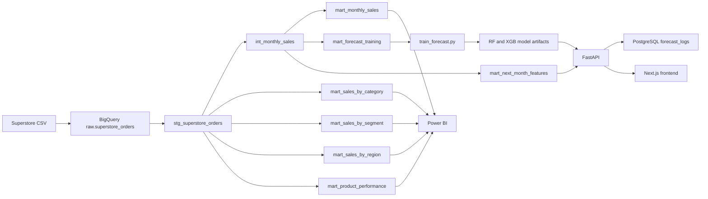

# Sales Analytics & Forecasting Platform

A containerized end-to-end platform that transforms raw retail order data into tested analytics models and next-month sales forecasts.

The platform uses BigQuery and dbt for warehouse modeling, Python for model training and validation, FastAPI for prediction serving, PostgreSQL for forecast logging, and Next.js and Power BI for consumption and visualization.

## Current Version

**v1.8 - Warehouse-driven analytics and forecasting**

The current version replaces the earlier Python-only EDA and feature-engineering workflow with a shared warehouse-native data layer.

Key improvements:

- BigQuery warehouse for raw and transformed order data
- dbt staging, intermediate, analytics, and forecasting models
- 9 dbt models and 47 data tests
- Leakage-safe lag and rolling features generated in SQL
- Separate training and next-month inference marts
- Shared Python feature contract
- Random Forest and XGBoost training pipeline
- FastAPI predictions sourced directly from the dbt feature mart
- PostgreSQL prediction logging
- Next.js forecast interface
- Docker Compose for local end-to-end execution
- GitHub Actions platform smoke checks

## Architecture


```mermaid
flowchart LR
    CSV[Superstore CSV] --> RAW[BigQuery raw.superstore_orders]

    RAW --> STG[stg_superstore_orders]
    STG --> INT[int_monthly_sales]

    STG --> CAT[mart_sales_by_category]
    STG --> SEG[mart_sales_by_segment]
    STG --> REG[mart_sales_by_region]
    STG --> PROD[mart_product_performance]

    INT --> MONTHLY[mart_monthly_sales]
    INT --> TRAIN_MART[mart_forecast_training]
    INT --> NEXT_MART[mart_next_month_features]

    TRAIN_MART --> TRAIN[train_forecast.py]
    TRAIN --> MODELS[RF and XGB model artifacts]

    NEXT_MART --> API[FastAPI]
    MODELS --> API

    API --> PG[PostgreSQL forecast_logs]
    API --> UI[Next.js frontend]

    MONTHLY --> BI[Power BI]
    CAT --> BI
    SEG --> BI
    REG --> BI
    PROD --> BI
```

The raw CSV is currently loaded into BigQuery before the dbt workflow runs. Automated ingestion and scheduled orchestration are future extensions.

## Platform Responsibilities

### Analytics path

```text
Raw orders
-> dbt staging
-> analytics marts
-> Power BI and analytics API consumers
```

The analytics marts provide monthly KPIs and category, segment, region, and product performance views.

### Forecasting path

Training:

```text
Raw orders
-> int_monthly_sales
-> mart_forecast_training
-> model training and evaluation
-> saved model artifact
```

Prediction:

```text
Latest completed monthly history
-> mart_next_month_features
-> FastAPI feature validation
-> selected forecasting model
-> PostgreSQL prediction log
-> Next.js result
```

The frontend does not ask users to enter lag values manually. The API reads the six validated features directly from BigQuery.

## dbt Model Layers

### Staging

`stg_superstore_orders`

Cleans column names, casts data types, and provides a stable contract over the raw order table.

### Intermediate

`int_monthly_sales`

Provides one reusable row per calendar month with:

- total sales
- total profit
- order count
- unique customer count

### Analytics marts

- `mart_monthly_sales`
- `mart_sales_by_category`
- `mart_sales_by_segment`
- `mart_sales_by_region`
- `mart_product_performance`

`mart_monthly_sales` contains analytics KPIs only. Forecast features are intentionally kept in separate forecasting marts.

### Forecasting marts

`mart_forecast_training`

One row per historical target month, containing the actual target and six features derived only from completed prior months.

`mart_next_month_features`

Exactly one row containing the six features required to forecast the next available month.

### Forecast feature contract

```text
lag_1
lag_2
lag_3
month_of_year
rolling_mean_3
rolling_mean_6
```

The same ordered contract is used by dbt, model training, saved model validation, and the prediction API.

## Data Quality

The current dbt project contains:

- 9 models
- 47 data tests
- 1 source
- 56 successful nodes in the full dbt build

The tests cover:

- uniqueness
- non-null constraints
- accepted categorical values
- forecasting feature values
- prediction mart row count
- complete historical feature windows
- target-month integrity

Latest validated build:

```text
PASS=56
WARN=0
ERROR=0
SKIP=0
```

## Forecasting Models

The platform supports:

- Random Forest
- XGBoost

Random Forest is the default model because it performed better in the current chronological hold-out evaluation.

### Random Forest hold-out evaluation

The evaluation uses the latest three months as a chronological hold-out.

| Metric | Seasonal-naive baseline | Random Forest |
|---|---:|---:|
| MAPE | 23.97% | 10.67% |
| sMAPE | 26.78% | 12.44% |
| MAE | 23,431.59 | 12,391.16 |
| RMSE | 25,977.29 | 20,547.28 |

The Random Forest reduced sMAPE by approximately 53.5% relative to the seasonal-naive baseline on this hold-out.

These results should be interpreted with care because the demonstration dataset and three-month hold-out are small.

### Feature comparison

A five-fold expanding-window experiment compares five features with the full six-feature contract.

For Random Forest, the six-feature set:

- achieved a lower average RMSE
- achieved a lower average sMAPE
- won 4 of 5 folds on RMSE
- won 3 of 5 folds on sMAPE

The sixth feature provides a modest average improvement rather than a universal improvement in every fold.

Run the experiment with:

```bash
python -m scripts.compare_feature_sets
```

## API

The current FastAPI application is `src.api:app`.

Core endpoints:

| Endpoint | Purpose |
|---|---|
| `GET /health` | Service version and available models |
| `GET /models` | Available forecasting models |
| `GET /predict?model=rf` | Forecast the next month from the dbt feature mart |
| `GET /logs/latest?limit=10` | Read recent PostgreSQL prediction logs |

Prediction flow:

```text
GET /predict?model=rf
-> query mart_next_month_features
-> validate six-feature contract
-> load Random Forest artifact
-> generate next-month forecast
-> write forecast_logs record
-> return prediction and feature snapshot
```

## Tech Stack

| Layer | Technology |
|---|---|
| Warehouse | Google BigQuery |
| Transformation | dbt-bigquery |
| Model training | Python, pandas, scikit-learn, XGBoost |
| Model serving | FastAPI |
| Operational database | PostgreSQL and SQLAlchemy |
| Frontend | Next.js, React, TypeScript |
| Analytics visualization | Power BI |
| Containerization | Docker and Docker Compose |
| CI | GitHub Actions |

## Local Quickstart

### Requirements

- Docker Desktop
- A Google Cloud service-account key with BigQuery access
- Existing raw order data in BigQuery
- dbt credentials configured separately when running dbt locally

### Docker environment

Create an untracked `.env` file in the repository root:

```dotenv
BQ_PROJECT_ID=your-gcp-project-id
BQ_DATASET=analytics
BQ_KEY_FILE_HOST=C:/path/to/service-account-key.json
```

Do not commit `.env` or service-account credentials.

### Start the platform

```bash
docker compose up --build
```

Local services:

- Frontend: `http://localhost:3000`
- FastAPI: `http://localhost:8000`
- API documentation: `http://localhost:8000/docs`
- PostgreSQL: `localhost:5432`

### Stop the platform

```bash
docker compose down
```

Use the following only when the local PostgreSQL volume should also be deleted:

```bash
docker compose down -v
```

## dbt Workflow

Configure the BigQuery target in your local dbt profile, then run:

```bash
cd sales_forecast_dbt
dbt build
```

Generate dbt documentation:

```bash
dbt docs generate
dbt docs serve
```

## Model Training

Set the BigQuery environment variables required by `src.bq_client`, then train the default model:

```bash
python -m src.train_forecast --model rf
```

Train XGBoost:

```bash
python -m src.train_forecast --model xgb
```

The training process:

1. Loads `mart_forecast_training`
2. Validates the training feature contract
3. Uses the latest months as a chronological hold-out
4. Compares the model with a seasonal-naive baseline
5. Retrains the final model on all validated rows
6. Saves the model artifact and evaluation outputs

## Project Structure

```text
.
|-- .github/
|   `-- workflows/
|       `-- smoke.yml
|-- backend/
|   `-- Dockerfile
|-- frontend/
|   `-- app/
|       `-- page.tsx
|-- reports/
|   `-- models/
|       |-- sales_forecast_rf.pkl
|       `-- sales_forecast_xgb.pkl
|-- sales_forecast_dbt/
|   |-- models/
|   |   |-- staging/
|   |   |-- intermediate/
|   |   `-- marts/
|   |-- tests/
|   `-- dbt_project.yml
|-- scripts/
|   `-- compare_feature_sets.py
|-- src/
|   |-- api.py
|   |-- bq_client.py
|   |-- db.py
|   |-- feature_contract.py
|   `-- train_forecast.py
|-- docker-compose.yml
|-- requirements.txt
`-- README.md
```

## CI Smoke Checks

The GitHub Actions workflow validates:

- Python source compilation
- FastAPI application import
- required API routes
- six-feature ordering
- Random Forest model creation
- committed Random Forest and XGBoost artifacts

The smoke workflow does not require live BigQuery or PostgreSQL connections.

## Project Evolution

- **v1.0** - Initial Python EDA and KPI reporting
- **v1.1** - Expanded analytical reporting
- **v1.2** - Initial Random Forest and XGBoost forecasting
- **v1.3** - FastAPI prediction endpoint
- **v1.4** - Next.js frontend
- **v1.5** - PostgreSQL prediction logging
- **v1.6** - Power BI dashboards
- **v1.7** - Docker and cloud deployment work
- **v1.8** - Warehouse-driven analytics and forecasting architecture

The old versioned Python EDA and API files were removed from the current source tree after their responsibilities were migrated to dbt, `train_forecast.py`, and `api.py`. Their history remains available through Git.

## Scope and Limitations

This is a domain-specific monthly sales forecasting platform, not a general AutoML or arbitrary-CSV prediction service.

A new dataset can use the existing pipeline when it follows the expected retail-order schema and represents the same forecasting problem. A dataset with different fields, targets, or business meaning requires a new data contract, dbt models, features, and model evaluation.

Current limitations:

- raw file ingestion is not automated
- dbt and training jobs are not scheduled
- no model registry or automatic rollback
- no data-drift or prediction-quality monitoring
- no automated retraining policy

## Dataset

The project uses the public Sample Superstore retail dataset for demonstration and portfolio purposes.