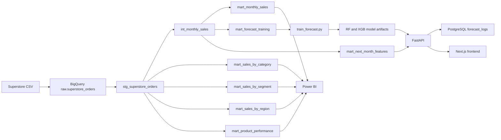
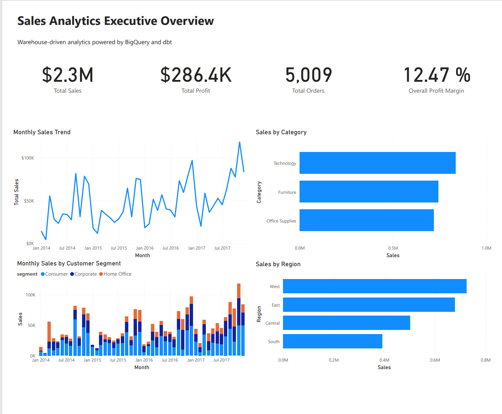
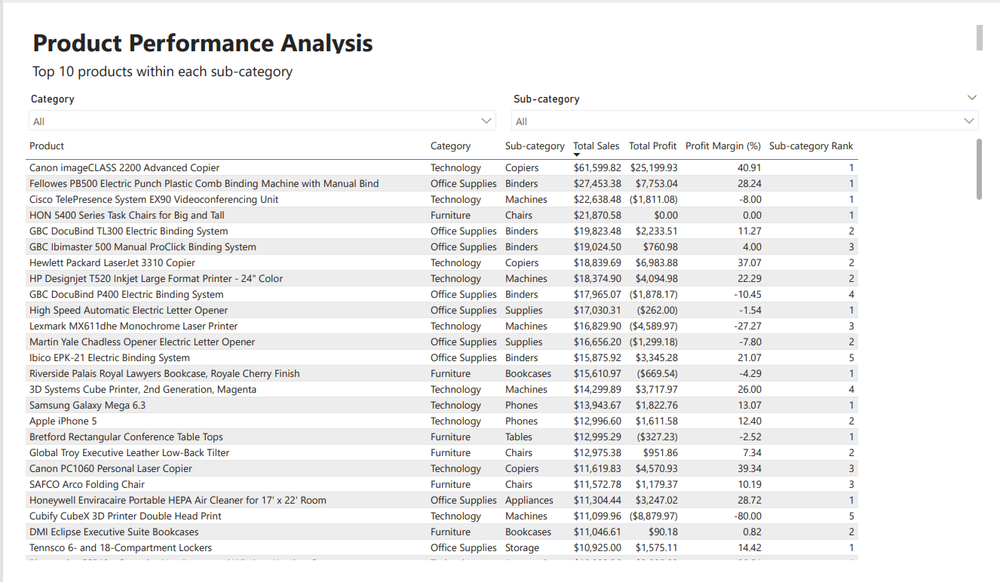

# Sales Analytics & Forecasting Platform

A warehouse-driven, end-to-end platform that transforms raw retail order data into tested analytics data products and next-month sales forecasts.

The platform uses BigQuery and dbt for warehouse modeling, Python for model training and validation, FastAPI for prediction serving, PostgreSQL for forecast logging, Power BI for business analytics, and Next.js for forecast interaction and history review.

## Current Version

**v1.8 — Warehouse-driven analytics and forecasting**

The current version replaces the earlier Python-only EDA and feature-engineering workflow with a shared warehouse-native data layer.

Key capabilities:

- BigQuery warehouse for raw and transformed retail order data
- Layered dbt staging, intermediate, analytics, and forecasting models
- 9 dbt models and 47 data tests
- 56 of 56 dbt build nodes passing
- Leakage-safe lag and rolling-window features generated in SQL
- Separate historical training and next-month inference marts
- Shared six-feature contract across dbt, Python, saved models, and API inference
- Random Forest and XGBoost training and evaluation pipeline
- FastAPI predictions sourced directly from the dbt feature mart
- PostgreSQL feature-snapshot and prediction logging
- Next.js forecast interface and history review
- Power BI report connected directly to five BigQuery analytics marts
- Executive Overview and Product Performance report pages
- Docker Compose for local end-to-end execution
- GitHub Actions platform smoke checks
- Cloud deployment across Render, Vercel, Neon PostgreSQL, and BigQuery

## Live Demo

- **Frontend:** [Sales Forecast Platform v1.8](https://sales-forecast-system-project.vercel.app)
- **Backend API:** [FastAPI service](https://sales-forecast-system-project.onrender.com)
- **API documentation:** [Swagger UI](https://sales-forecast-system-project.onrender.com/docs)
- **Health endpoint:** [Service health](https://sales-forecast-system-project.onrender.com/health)

The deployed workflow has been validated end to end:

```text
Vercel frontend
-> Render FastAPI
-> BigQuery dbt feature mart
-> Random Forest or XGBoost model
-> Neon PostgreSQL prediction log
-> frontend result and history
```

## Architecture


```mermaid
flowchart LR
    CSV[Superstore CSV] --> RAW[BigQuery raw.superstore_orders]

    RAW --> STG[stg_superstore_orders]
    STG --> INT[int_monthly_sales]

    STG --> CAT[mart_sales_by_category]
    STG --> SEG[mart_sales_by_segment]
    STG --> REG[mart_sales_by_region]
    STG --> PROD[mart_product_performance]

    INT --> MONTHLY[mart_monthly_sales]
    INT --> TRAIN_MART[mart_forecast_training]
    INT --> NEXT_MART[mart_next_month_features]

    TRAIN_MART --> TRAIN[train_forecast.py]
    TRAIN --> MODELS[RF and XGB model artifacts]

    NEXT_MART --> API[FastAPI]
    MODELS --> API

    API --> PG[PostgreSQL forecast_logs]
    API --> UI[Next.js frontend]

    MONTHLY --> BI[Power BI]
    CAT --> BI
    SEG --> BI
    REG --> BI
    PROD --> BI
```

The raw CSV is currently loaded into BigQuery before the dbt workflow runs. Automated ingestion and scheduled orchestration are future extensions.

## Platform Responsibilities

### Analytics path

```text
Raw retail orders
-> dbt staging
-> reusable intermediate models
-> business-ready analytics marts
-> Power BI and analytics API consumers
```

The analytics marts provide:

- monthly sales KPIs
- category and sub-category performance
- customer-segment performance
- regional and state-level performance
- product-level sales, profit, margin, and ranking

### Forecasting path

Training:

```text
Raw retail orders
-> int_monthly_sales
-> mart_forecast_training
-> feature-contract validation
-> chronological model training and evaluation
-> saved RF or XGBoost model artifact
```

Prediction:

```text
Latest completed monthly history
-> mart_next_month_features
-> FastAPI feature validation
-> selected forecasting model
-> PostgreSQL prediction log
-> Next.js result and history
```

The frontend does not ask users to enter lag values manually. The API reads the six validated features directly from BigQuery.

## Power BI Analytics

The Power BI report connects directly to the five analytics marts in BigQuery:

- `mart_monthly_sales`
- `mart_sales_by_category`
- `mart_sales_by_segment`
- `mart_sales_by_region`
- `mart_product_performance`

The reporting layer is intentionally separated from the forecasting serving path:

```text
Analytics marts
-> Power BI reporting

Forecasting marts
-> Python training and FastAPI inference
```

### Executive Overview

The Executive Overview page provides:

- total sales
- total profit
- total orders
- overall profit margin
- monthly sales trend
- sales by category
- monthly sales by customer segment
- sales by region



### Product Performance

The Product Performance page provides:

- category and sub-category filters
- the top 10 products within each sub-category
- product-level sales
- product-level profit
- profit margin
- ranking within each sub-category



The final `.pbix` file and exported PDF are maintained separately and excluded from Git. The screenshots above document the final v1.8 report output.

## dbt Model Layers

### Staging

`stg_superstore_orders`

Cleans column names, casts data types, and provides a stable contract over the raw order table.

**Grain:** one row per retail order line.

### Intermediate

`int_monthly_sales`

Provides one reusable row per calendar month with:

- total sales
- total profit
- order count
- unique customer count

**Grain:** one row per calendar month.

### Analytics marts

- `mart_monthly_sales`
- `mart_sales_by_category`
- `mart_sales_by_segment`
- `mart_sales_by_region`
- `mart_product_performance`

`mart_monthly_sales` contains analytics KPIs only. Forecasting features are intentionally kept in separate forecasting marts.

The marts are designed as business-ready data products for Power BI, analytical APIs, and other downstream consumers.

### Forecasting marts

#### `mart_forecast_training`

One row per historical target month, containing the actual target and six features derived only from completed prior months.

The current demonstration dataset produces 42 valid historical training rows after requiring complete historical feature windows.

#### `mart_next_month_features`

Exactly one row containing the six features required to forecast the next available month.

### Forecast feature contract

```text
lag_1
lag_2
lag_3
month_of_year
rolling_mean_3
rolling_mean_6
```

The same ordered contract is used by:

- dbt forecasting marts
- Python training validation
- saved model-artifact validation
- FastAPI inference

This prevents training-serving feature mismatches and silent substitution of missing features.

## Data Quality

The current dbt project contains:

- 9 models
- 47 data tests
- 1 source
- 56 successful nodes in the full dbt build

The tests cover:

- uniqueness
- non-null constraints
- accepted categorical values
- forecasting feature validity
- prediction-mart row count
- complete historical feature windows
- target-month integrity
- valid month-of-year ranges
- required historical continuity

Latest validated build:

```text
PASS=56
WARN=0
ERROR=0
SKIP=0
```

## Leakage Prevention

Forecasting features are generated only from completed prior months.

For a target month, rolling features exclude the current target row:

```text
historical rows
-> 6 PRECEDING
-> through 1 PRECEDING
-> target month excluded
```

This prevents the target value from leaking into its own feature set.

The original implementation included the current row in rolling calculations. The v1.8 architecture corrected the window boundaries and separated analytics KPIs from forecasting features.

## Forecasting Models

The platform supports:

- Random Forest
- XGBoost

Random Forest is the default model because it performed better in the current chronological hold-out evaluation.

### Evaluation design

The evaluation pipeline:

1. Loads `mart_forecast_training`
2. Validates the shared feature contract
3. Preserves chronological ordering
4. Uses the latest three months as the hold-out period
5. Compares the model with a seasonal-naive baseline
6. Retrains the final selected model on all validated rows
7. Saves the final serialized model artifact

A random train-test split is not used because it would allow future periods to influence evaluation of earlier periods.

### Random Forest hold-out evaluation

| Metric | Seasonal-naive baseline | Random Forest |
|---|---:|---:|
| MAPE | 23.97% | 10.67% |
| sMAPE | 26.78% | 12.44% |
| MAE | 23,431.59 | 12,391.16 |
| RMSE | 25,977.29 | 20,547.28 |

Random Forest reduced sMAPE by approximately 53.5% relative to the seasonal-naive baseline on the three-month hold-out.

These results should be interpreted with care because the demonstration dataset and hold-out period are small.

### XGBoost hold-out evaluation

| Metric | XGBoost |
|---|---:|
| MAPE | 22.89% |
| sMAPE | 25.89% |
| MAE | 21,779.58 |
| RMSE | 22,727.09 |

Random Forest therefore remains the recommended default model for the current dataset.

### Feature comparison

A five-fold expanding-window experiment compares five features with the full six-feature contract.

For Random Forest, the six-feature set:

- achieved a lower average RMSE
- achieved a lower average sMAPE
- won 4 of 5 folds on RMSE
- won 3 of 5 folds on sMAPE

For XGBoost, the six-feature set:

- won 3 of 5 folds on RMSE
- won 2 of 5 folds on sMAPE

The sixth feature provides a modest average improvement rather than a universal improvement in every fold.

Run the experiment with:

```bash
python -m scripts.compare_feature_sets
```

## Feature Contract and Reliability

`src/feature_contract.py` validates:

- all six required feature columns
- exact feature ordering
- null values
- numeric values
- valid month-of-year ranges
- target-month uniqueness
- exactly one inference row
- saved-model feature names

The v1.8 reliability work also removed:

- silent fallback to a baseline prediction
- default substitution of unknown features with zero
- manual lag entry in the frontend
- duplicated feature logic across training and serving
- the incorrect substitution of `rolling_mean_6` with `rolling_mean_3`
- outdated API and EDA implementations
- inconsistent Python versions across local, Docker, and CI environments

## API

The current FastAPI application is:

```text
src.api:app
```

Core endpoints:

| Endpoint | Purpose |
|---|---|
| `GET /health` | Service version and available models |
| `GET /models` | Available forecasting models |
| `GET /predict?model=rf` | Forecast the next month using the Random Forest model |
| `GET /predict?model=xgb` | Forecast the next month using the XGBoost model |
| `GET /logs/latest?limit=10` | Read recent PostgreSQL prediction logs |

Prediction flow:

```text
GET /predict?model=rf
-> query mart_next_month_features
-> validate the six-feature contract
-> load the cached Random Forest artifact
-> generate the next-month forecast
-> write a forecast_logs record
-> return the prediction and feature snapshot
```

Example response:

```json
{
  "target_month": "2018-01-01",
  "prediction": 28605.9,
  "model": "rf",
  "features": {
    "lag_1": 83829.3188,
    "lag_2": 118447.825,
    "lag_3": 77776.9232,
    "month_of_year": 1,
    "rolling_mean_3": 93351.3557,
    "rolling_mean_6": 79384.3372
  },
  "feature_source": "mart_next_month_features",
  "logged": true
}
```

Internal exceptions are logged by the backend but are not returned directly to API clients.

When BigQuery forecast features are unavailable, the API returns a controlled service-unavailable response instead of silently returning an alternative prediction.

## Prediction Logging

Each successful prediction stores:

- selected model
- target month
- all six input features
- prediction value
- creation timestamp

This makes forecast requests traceable and allows the frontend to display recent prediction history.

## Tech Stack

| Layer | Technology |
|---|---|
| Warehouse | Google BigQuery |
| Transformation | dbt-bigquery |
| Analytics modeling | SQL and dbt |
| Model training | Python, pandas, scikit-learn, XGBoost |
| Model serving | FastAPI |
| Operational database | PostgreSQL, Neon, SQLAlchemy |
| Frontend | Next.js, React, TypeScript |
| Analytics visualization | Power BI |
| Containerization | Docker and Docker Compose |
| Backend deployment | Render |
| Frontend deployment | Vercel |
| CI | GitHub Actions |

## Local Quickstart

### Requirements

- Docker Desktop
- A Google Cloud service-account key with BigQuery access
- Existing raw retail order data in BigQuery
- dbt credentials configured separately when running dbt locally

### Docker environment

Create an untracked `.env` file in the repository root:

```dotenv
BQ_PROJECT_ID=your-gcp-project-id
BQ_DATASET=analytics
BQ_KEY_FILE_HOST=C:/path/to/service-account-key.json
```

Do not commit `.env` or service-account credentials.

### Start the platform

```bash
docker compose up --build
```

Local services:

- Frontend: `http://localhost:3000`
- FastAPI: `http://localhost:8000`
- API documentation: `http://localhost:8000/docs`
- PostgreSQL: `localhost:5432`

### Stop the platform

```bash
docker compose down
```

Use the following only when the local PostgreSQL volume should also be deleted:

```bash
docker compose down -v
```

## dbt Workflow

Configure the BigQuery target in your local dbt profile, then run:

```bash
cd sales_forecast_dbt
dbt build
```

Generate dbt documentation:

```bash
dbt docs generate
dbt docs serve
```

## Model Training

Set the BigQuery environment variables required by `src.bq_client`, then train the default model:

```bash
python -m src.train_forecast --model rf
```

Train XGBoost:

```bash
python -m src.train_forecast --model xgb
```

The training process:

1. Loads `mart_forecast_training`
2. Validates the training feature contract
3. Uses the latest months as a chronological hold-out
4. Compares the model with a seasonal-naive baseline
5. Evaluates the selected forecasting model
6. Retrains the final model on all validated rows
7. Saves the model artifact and evaluation outputs

## Power BI Workflow

The Power BI report connects directly to the five BigQuery analytics marts.

Current report pages:

```text
Executive Overview
Product Performance
```

To refresh the report locally:

1. Open `Sales_Forecasting_Analytics_Platform_v1.8.pbix`
2. Authenticate to Google BigQuery
3. Select `Home -> Refresh`
4. Validate both report pages
5. Save the updated `.pbix`
6. Export the report to PDF when needed

The `.pbix` file is excluded from Git and should be backed up separately.

## Project Structure

```text
.
|-- .github/
|   `-- workflows/
|       `-- smoke.yml
|-- backend/
|   `-- Dockerfile
|-- docs/
|   `-- images/
|       |-- powerbi_executive_overview_v1.8.png
|       `-- powerbi_product_performance_v1.8.png
|-- frontend/
|   `-- app/
|       `-- page.tsx
|-- reports/
|   `-- models/
|       |-- sales_forecast_rf.pkl
|       `-- sales_forecast_xgb.pkl
|-- sales_forecast_dbt/
|   |-- models/
|   |   |-- staging/
|   |   |-- intermediate/
|   |   `-- marts/
|   |-- tests/
|   `-- dbt_project.yml
|-- scripts/
|   `-- compare_feature_sets.py
|-- src/
|   |-- api.py
|   |-- bq_client.py
|   |-- db.py
|   |-- feature_contract.py
|   `-- train_forecast.py
|-- docker-compose.yml
|-- requirements.txt
`-- README.md
```

## CI Smoke Checks

The GitHub Actions workflow validates:

- Python source compilation
- FastAPI application import
- API version
- required API routes
- six-feature ordering
- Random Forest model creation
- committed Random Forest artifact
- committed XGBoost artifact
- saved-model feature compatibility

The smoke workflow does not require live BigQuery or PostgreSQL connections.

## Deployment

### Backend

The FastAPI backend is deployed on Render.

Runtime configuration includes:

- `BQ_PROJECT_ID`
- `BQ_DATASET`
- `BQ_KEY_FILE`
- `DATABASE_URL`
- allowed CORS origins

The Google Cloud service-account JSON is provided as a Render Secret File and is not stored in Git.

### Frontend

The Next.js frontend is deployed on Vercel.

The production API endpoint is configured through:

```text
NEXT_PUBLIC_API_BASE_URL
```

### Operational database

Prediction logs are stored in Neon PostgreSQL.

### Warehouse

Analytics and forecasting data products are stored in Google BigQuery and generated by dbt.

## Project Evolution

- **v1.0** — Initial Python EDA and KPI reporting
- **v1.1** — Expanded analytical reporting
- **v1.2** — Initial Random Forest and XGBoost forecasting
- **v1.3** — FastAPI prediction endpoint
- **v1.4** — Next.js frontend
- **v1.5** — PostgreSQL prediction logging
- **v1.6** — Initial Power BI forecast-log dashboard
- **v1.7** — Docker and cloud deployment work
- **v1.8** — Warehouse-driven analytics and forecasting architecture, rebuilt Power BI reporting on five BigQuery analytics marts, reliability improvements, and validated end-to-end cloud deployment

The old versioned Python EDA and API files were removed from the current source tree after their responsibilities were migrated to dbt, `train_forecast.py`, and `api.py`.

Their development history remains available through Git.

## Production-Oriented Design Choices

The platform includes several production-oriented engineering decisions:

- centralized transformation logic in dbt
- clearly defined model grain
- separate analytics, training, and inference marts
- leakage-safe historical features
- explicit training-serving feature contract
- controlled API error handling
- no silent prediction fallback
- saved input-feature snapshots
- containerized local execution
- CI smoke checks
- environment-specific secret management
- independently deployed frontend, backend, warehouse, and operational database

## Scope and Limitations

This is a domain-specific monthly sales forecasting platform, not a general AutoML or arbitrary-CSV prediction service.

A new dataset can use the existing pipeline when it follows the expected retail-order schema and represents the same forecasting problem.

A dataset with different fields, targets, or business meaning requires:

- a new source-data contract
- updated staging logic
- new business transformations
- new forecasting features
- new model evaluation

Current limitations:

- raw file ingestion is not automated
- dbt and training jobs are not scheduled
- no workflow orchestrator
- no model registry or automatic rollback
- no data-drift monitoring
- no prediction-quality monitoring after deployment
- no automated retraining policy
- no user authentication
- limited centralized observability
- Power BI refresh is currently performed manually in Power BI Desktop
- Power BI Service publishing and scheduled refresh are not configured

## Dataset

The project uses the public Sample Superstore retail dataset for demonstration and portfolio purposes.

The dataset is used to demonstrate:

- warehouse modeling
- analytics engineering
- data-quality testing
- forecasting feature engineering
- chronological model evaluation
- API serving
- operational logging
- BI reporting
- containerized and cloud deployment